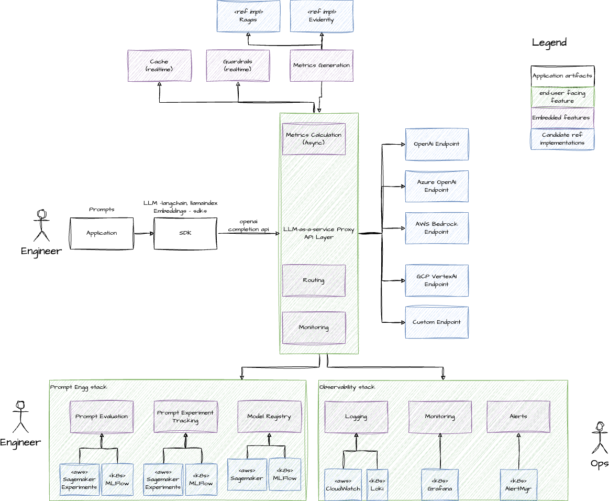
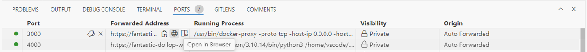
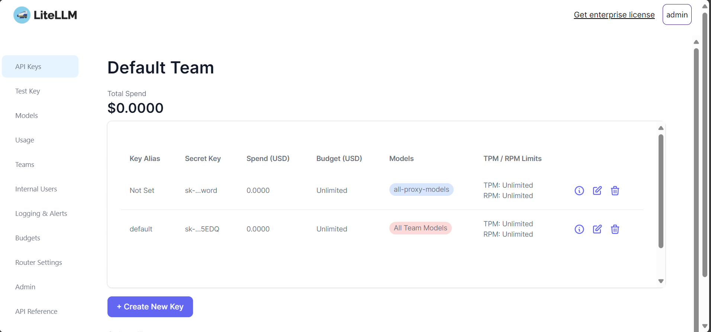
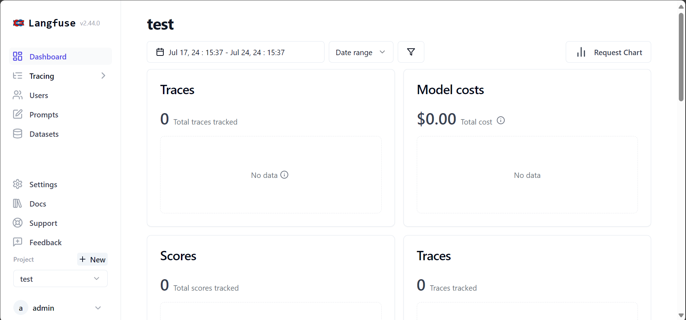

# LLM Gateway - DEP AI

[](https://github.com/codespaces/new?hide_repo_select=true&ref=feat%2Fllm-gateway-in-engg-portal&repo=804304038)

`Recommended Configuration : 4-core , 16 GB RAM`

## Introduction

Every developer and team that builds a GenAI solution or product needs to implement a set of common NFRs in order to track performance, reduce costs, and be well-rounded for enterprise deployments. Built on top of Open Source technologies, DEP AI's LLM Gateway approach aims to simplify the implementation for asset teams by providing easily integratable components that take care of the following functionality:

- **Routing** - We provide the ability to configure and route your requests to any LLM required with a simple API using LiteLLM. LLM Gateway supports multiple LLM providers including OpenAI, Azure OpenAI, AWS Bedrock, Google Cloud Gemini, and even hosting your own LLMs.
- **Virtual Keys** - Create virtual keys with fine-grained access controls to decide which users/system components have access to which LLMs without exposing the underlying secrets.
- **Caching** - Integrate a caching layer to reduce the number of calls to the LLMs and improve the performance of your application while reducing costs. We support both Simple and Semantic caching with Redis.
- **Tracing** - Track and trace all your LLM calls, monitor requests and responses, and track cost and latencies of your LLM usage using Langfuse.
- **PII Masking** - Mask PII/PHI data in your LLM calls to avoid sensitive information being exposed to the LLM providers.



## Getting Started

This dev container experience is the easiest way to experience LLM Gateway. This container includes all the necessary components to run LLM Gateway and is pre-configured with a sample LLM provider.

The devcontainer features used in this repo are listed below with a link to the respective feature documentation:

- [ollama](https://github.com/Deloitte-US-Engineering/engacc-devcontainer-features/blob/main/src/ollama/README.md)
- [llm-gateway](https://github.com/Deloitte-US-Engineering/engacc-devcontainer-features/blob/main/src/llm-gateway/README.md)

## Components:

Listed below are some of the LLM Gateway components that are configured in this dev container and the credentials to access them for this demonstration.

| S.No. | Component | Port | Notes |
|----------:|:----------|:----------|:----------|
| 1   | LiteLLM   | 4000 | Used as the core routing agent to configure LLM deployments. <ul><li>UI is available at **https://<CODESPACE_NAME>-4000.app.github.dev/ui**  </li><li>Credentials: admin, sk-password</li></ul> |
| 2    | Redis   | 6379 | Used as the caching layer for LLM calls.  |
| 3    | Postgres   | 5432 | Database layer to store LiteLLM and Langfuse metadata  |
| 4    | Langfuse   | 3001 | Tracing component used to keep track of LLM calls, latencies, and costs<ul><li>UI is available at **https://<CODESPACE_NAME>-3001.app.github.dev**</li><li>Credentials: admin@dep.com, password</li></ul>   |
| 5    | Presidio [Optional]   | 5001,5002 | Open-source tool for PII/PHI Masking  |
| 6    | Ollama   | 11434 | Model serving library used to serve open-source models such as `phi3` and `nomic-embed-text` for this experience.    |

## Basic Usage:

This repo has been configured to start with the LLM Gateway components listed above (Except presidio service. See section on enabling presidio), along with some open-source models using Ollama, upon opening in a codespace. Credentials for services such as LiteLLM and Langfuse are pre-set and can be accessed through the URLs listed in the components table above, or by using the PORTS tab (click on the globe icon near the forwarded address column on the corresponding port number to open in the browser).



#### LiteLLM Dashboard

You can access the LiteLLM dashboard by navigating to the URL `https://<CODESPACE_NAME>-4000.app.github.dev/ui` in your browser. The admin username is `admin` and the password is `sk-password` (which is the master password for litellm and is set with `LITELLM_MASTER_KEY` variable in `/opt/llm_gateway/.env`). 



The LiteLLM dashboard allows you to configure models, virtual keys, and teams. One virtual key is pre-configured with this codespace. See the code in demo notebook under the 'Virtual Keys' section.

For more information on how to use virtual keys, refer to the [LiteLLM documentation](https://docs.litellm.ai/docs/proxy/virtual_keys). 

#### Langfuse Dashboard

This codespace is pre-configured with Langfuse, a tracing component that allows you to track and trace all your LLM calls, monitor requests and responses, and track cost and latencies of your LLM usage. You can access the Langfuse dashboard by navigating to the URL `https://<CODESPACE_NAME>-3001.app.github.dev` in your browser.  



A langfuse project is pre-configured with this codespace and the login credentials to the project are 'admin@dep.com' and 'password'. LLM Gateway requires API keys (public key and secret key) to be set as environment variables. The API keys for the preconfigured project are set in the `.env` file at `/opt/llm_gateway/.env`.

`Note: Langfuse is pre-configured with a project and API keys. You can create a new project and set the API keys in the .env file to use Langfuse with your own project.`

### Customize models

The first step is to configure all the LLMs that you would like to route through the LLM Gateway. This can be done with the `model-config.yaml` file as shown below. 

This config file configures models from OpenAI, Bedrock, and Ollama to be routed through the LLM Gateway. It also configures caching with Redis, tracing with Langfuse, and PII masking with Presidio to be applied to all the LLMs configured.

### Sample configuration for LiteLLM

```yaml filename="model-config.yaml"
model_list:
  - model_name: gpt-3.5-turbo
    litellm_params:
      model: openai/gpt-3.5-turbo
      api_key: os.environ/OPENAI_API_KEY
  - model_name: bedrock-llama2-13b 
    litellm_params: 
      model: bedrock/meta.llama2-13b-chat-v1 
      aws_region_name: us-east-1
  - model_name: gemini-pro
    litellm_params:
      model: vertex_ai/gemini-1.5-pro
      vertex_project: "dip-gcp-converconsumer-sbx"
      vertex_location: "us-east1"
  - model_name: phi3 
    litellm_params:
      model: ollama/phi3 
      api_base: http://0.0.0.0:11434
      api_key: "dummy"
  - model_name: nomic-embed-text
    litellm_params:
      model: ollama/nomic-embed-text
      api_base: http://0.0.0.0:11434
      api_key: "dummy"
litellm_settings:
  callbacks : ["presidio"] # Optional callback when Presidio is enabled in feature
  success_callback: ["langfuse"] # Optional callback when Langfuse is enabled in feature, and required env variables are set in the environment
  drop_params: True
  telemetry: False
  set_verbose: True
  cache: True          # set cache responses to True, litellm defaults to using a redis cache
  cache_params:
    type: "redis"
```

Sample config files to add LLMs from various providers will be available in the `/opt/llm_gateway/configs` directory when you add the llm-gateway feature to your devcontainer config. The same set of configs is made available in the `configs` folder of this repo. You can set the appropriate environment variables in the `.env` file at `/opt/llm_gateway/.env` (such as OpenAI API keys) and use the `start-llm-gateway.sh` script to start the LLM Gateway.

```bash
/opt/llm_gateway/start-llm-gateway.sh --config /opt/llm_gateway/configs/model-config-ollama.yaml 
```

Below is a sample code snippet to use the LLM Gateway to route your requests to the LLMs using Langchain. Note that you can use any model with the OpenAI chat model from Langchain by configuring the API base URL to point to the LLM Gateway endpoint. 

 ```python filename="chat_langchain.py"
      from langchain.chat_models import ChatOpenAI

      chat = ChatOpenAI(
         openai_api_base="http://0.0.0.0:4000", # set openai_api_base to the LLM Gateway endpoint
         model = "phi3", # model name from the model-config.yaml
         temperature=0.1, # additional model configs
         api_key="sk-password" # virtual key/master key setup in LLM Gateway
      )
```

### Use other LLM providers

As this devcontainer is configured to start with a set of pre-defined configurations, you need to stop the gateway service before starting the LLM Gateway with a new model config file. For the exhaustive list of LLM providers supported by LiteLLM, refer to the [LiteLLM documentation](https://docs.litellm.ai/docs/providers).

Stop the litellm service by running the `stop-llm-gateway.sh` script

```bash
/opt/llm_gateway/stop-llm-gateway.sh
```

Read the following sections to configure the LLM Gateway with different LLM providers.

#### OpenAI

A sample config for OpenAI is available at `/opt/llm_gateway/configs/model-config-openai.yaml`.

For example, here is a sample model config for gpt-3.5-turbo in the `model-config-openai.yaml` file

```yaml
model_list:
  - model_name: gpt-3.5-turbo
    litellm_params:
      model: openai/gpt-3.5-turbo
      api_key: os.environ/OPENAI_API_KEY
```

Add or change the required model names and aliases in the `model-config-openai.yaml` file and set the OpenAI API key in the `/opt/llm_gateway/.env` file

```bash
OPENAI_API_KEY=sk-1234567890
```

and start the LLM Gateway with the following command

```bash
/opt/llm_gateway/start-llm-gateway.sh --config /opt/llm_gateway/configs/model-config-openai.yaml 
```

#### Bedrock

AWS authentication is required to access the Bedrock models. Refer to the feature [here](https://github.com/Deloitte-US-Engineering/engacc-devcontainer-features/tree/main/src/dep-ai) for adding okta-aws-cli to your devcontainer. 

Once the feature is added to the `devcontainer.json`, rebuild the codespace and login to okta-aws-cli using the following command in the terminal

```bash
okta-dep-auth.sh
```

After authenticating with okta-cli, LLM Gateway may be started with a model config file. A sample config for Bedrock is available at `/opt/llm_gateway/configs/model-config-bedrock.yaml`. For example, here is a sample model config for meta.llama2-13b-chat-v1 model in the `model-config-bedrock.yaml` file

```yaml
  - model_name: meta.llama2-13b-chat-v1 ### Model name to be passed by user (can be custom)
    litellm_params: 
      model: bedrock/meta.llama2-13b-chat-v1 ### Actual model name
      aws_region_name: us-east-1

```

Add or change the required model names and aliases in the `model-config-bedrock.yaml` file and start the LLM Gateway with the following command

```bash
/opt/llm_gateway/start-llm-gateway.sh --config /opt/llm_gateway/configs/model-config-bedrock.yaml 
```

Note: As the temporary credentials expire, you may need to re-authenticate with okta-aws-cli to get new credentials and restart the LLM Gateway to apply the new credentials.

#### Gemini

Setup environment:
Please run this to add vertex credentials to your env

```
gcloud auth application-default login
```

Please install Vertex AI API client library using below command. 

```
pip install google-cloud-aiplatform
```


### Enable Presidio for PII masking

Presidio service is not enabled in this repo. To enable Presidio, stop the LLM Gateway service 

```bash
/opt/llm_gateway/stop-llm-gateway.sh
```

Then you can start the Presidio anonymizer and analyzer services with the following command in the terminal

```bash
docker-compose -f /opt/llm_gateway/llm_gateway_packages/docker-compose.yaml up presidio-analyzer presidio-anonymizer -d
```

After the services have started, you can start the LLM Gateway with a model config file that has the `presidio` callback enabled. You can reuse the sample config file in the `configs` directory of this repo. Open `model-config-ollama.yaml` file and set the `callbacks` parameter to `["presidio"]` as shown below

```yaml
...
litellm_settings:
  callbacks : ["presidio"] # Optional callback when Presidio is enabled 
...
```

Now start the LLM Gateway with the following command

```bash 
/opt/llm_gateway/start-llm-gateway.sh --config /workspaces/engacc-llm-gateway/configs/model-config-ollama.yaml
```

`Note: : LiteLLM requires the base addresses of Presidio analyzer and anonymizer services to be set as environment variables. The base addresses are set in the sample .env file at /opt/llm_gateway/.env`

### Troubleshooting

Try the following steps if you encounter any issues while with LLM Gateway services in this codespace:

- Check the logs at /opt/llm_gateway/logs/llm-gateway.log
- Ensure the model config file is correctly configured, refer to the sample config files in /opt/llm_gateway/configs
- Rebuild the codespace if any of the LLM Gateway components have not started
- If the LiteLLM service is not running/unavailable in the PORTS tab, stop the service using the `stop-llm-gateway.sh` script and start the service either by running `start-llm-gateway.sh` with proper configs at `/opt/llm_gateway/` directory or start the LLM Gateway with default configs by running the `postStart.sh` script manually by running `.devcontainer/postStart.sh` in the terminal

### References

This codespace LLM Gateway is built on top of the following open-source technologies:
- [LiteLLM](https://docs.litellm.ai/docs/)
- [Langfuse](https://langfuse.com/docs)
- [Ollama](https://ollama.com/)
- [Presidio](https://microsoft.github.io/presidio/)
- [Redis-Stack](https://redis.io/blog/introducing-redis-stack/)
- [Langchain](https://python.langchain.com/v0.2/docs/introduction/)

